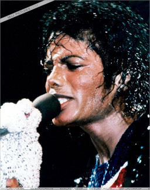
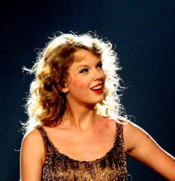

# **FaceMatch**
Final project for **SCC0251/SCC5830 - Image Processing - 1st Semester of 2020** at University of São Paulo.

## **Abstract**
This project aims to build a system capable of verifying the presence of someone's face in an image. It will use image segmentation to separate the faces from the rest of the images, and image classification to determine weather the face belongs to a given person. The images used will be photographic images of people showing their faces, mainly from the WIDER and CelebA datasets. Possible application revolve around any problem that needs to verify someone by their face, like many security or survailence systems.

## **Detailed Description**
This project is aimed at the face verification problem. It is divided in two parts, segmentation and verification.
The segmentation aspect is the main strictly image processing aspect of the project, and consists of generating a bounding boxes of people's faces in an image, and subsequently cropping them.
The verification aspect consists of getting two images of faces, and determining if the faces belong to the same person.
For both aspects of the project, we intend to compare several approches, both classical and deep learning ones, and analyze both accuracy as well as computational costs.

## **Example Images**

*Image 1 - First Image of Michael Jackson*

*Image 2 - Second Image of Michael Jackson*

*Image 3 - Image of Taylor Swift*

The system built by this project should, in all images, be able to crop the faces out of them, and then identify that the first and the sencond belong to the same person, and the third to a different person.

## **Authors**
 - Eduardo Santos Carlos de Souza (NUSP 9293481)
 - Guilherme Hideo Tubone (NUSP 9019403)

**Keywords:** Image Segmentation; Feature Learning; Deep Learning; Faces; Face Verification; Triplet Loss;