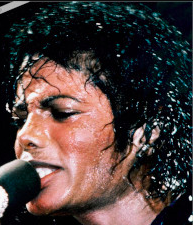

# **FaceMatch - An Image Face Verifier**
Final project for **SCC0251/SCC5830 - Image Processing - 1st Semester of 2020** at University of São Paulo.

## **Abstract**
This project aims to build a system capable of, given two images, determine if both have the face of the same person or different people in them, known as the face verification problem. It will use image segmentation to separate the faces from the rest of the images, and image classification to determine whether the cropped faces belong to the same person. The images used will be photographic images of people, where their faces are visible, mainly from the CelebA dataset. Possible applications revolve around security, where it is needed to verify someone's identity by an image of them, such as unlocking a phone and many surveillance systems.

## **Main Objective**
As stated in the abstract, our objective is to create a system capable of verifying if the 2 images of people have the face of the same perosn in them or not. Therefore the main objective can be broken down into two parts:

1. A Segmentation Algorithm: Given a single image, crop out the location of the face in it. We will limit our scope to only one face per image.
2. A Verification Algorithm: Given two already segmented faces, determine if they belong to the same person or not.

## **Data Used**
To achieve or goals, we will need large and varied datasets with two important characteristics:

1. Annotation of bounding boxes of the face present in the image. As stated before, we will work with only a single face per image.
2. Annotation of the identity of the person present in the image.

The [CelebA](http://mmlab.ie.cuhk.edu.hk/projects/CelebA.html) dataset has both those characteristics, and is also extremely large, having 202,599 images. There are two versions of it, one with the raw image, the other with the face already mostly cropped. We will use the raw version, and initially intend to use it exclusevely.

However there are other possibly useful datasets. We curently don't intend to use them, but we may later. They are:

1. [WIDER](http://shuoyang1213.me/WIDERFACE/):

    * More varied them CelebA.
    * It lacks identity annotation, so it would only be useful for the segmentation aspect of the project.
    * Many images have more them one face in them, so filtering would be required.

2. [LFW](http://vis-www.cs.umass.edu/lfw/):

    * Specialized for verification, having many images per person.
    * It lacks bounding box annotation, so it would only be useful for the verification aspect of the project

### **CelebA Examples**
</img>

*Image 1.1 - Imaging containing mostly the head*

</img>

*Image 1.2 - Imaging containing entire body*

</img>

*Image 2.1 - First Image of Individual 1058*

</img>

*Image 2.2 - Second Image of Individual 1058*

</img>

*Image 3.1 - Image 2.1 segmented with bounding box annotation*

</img>

*Image 3.2 - Image 2.2 segmented with bounding box annotation*

## **Detailed Description**
This project is aimed at the face verification problem. It is divided into two parts, segmentation and verification.

The segmentation aspect is the main strictly image processing aspect of the project, and consists of generating bounding boxes of people's faces in an image, and subsequently cropping them. Currently, we are aiming at only one bounding box per image.
The verification aspect consists of getting two images of faces and determining if the faces belong to the same person.

For both aspects of the project, we intend to compare different approaches, both classical and deep learning ones, and analyze both accuracies as well as computational costs.

In terms of the deep learning models, for the segmentation we will attempt to use CNN's, with Depth-Wise Separable Convolutions for faster execution.
For the verification, we will attempt to fine-tune a pre-trained network, trained on a regular classification dataset, using the triplet loss. The idea is to get an extractor of highly separable feature vectors, and use those to distinguish the faces.

## **Example Images**

*Image 1.1 - First Image of Michael Jackson*

*Image 1.2 - Cropped Image 1.2*

*Image 2.1 - Second Image of Michael Jackson*

*Image 2.2 - Cropped Image 2.1*

*Image 3.1 - Image of Taylor Swift*

*Image 3.2 - Cropped Image 3.1*

The system built by this project should, in all images, be able to crop the faces out of them, and then identify the first and the second as belonging to the same person, and the third to a different person.

## **Authors**
 - Eduardo Santos Carlos de Souza (NUSP 9293481)
 - Guilherme Hideo Tubone (NUSP 9019403)

**Keywords:** Image Segmentation; Feature Learning; Deep Learning; Faces; Face Verification; Triplet Loss;
