# **FaceMatch - An Image Face Verifier**
Final project for **SCC0251/SCC5830 - Image Processing - 1st Semester of 2020** at University of São Paulo.

## **Authors**
 - Eduardo Santos Carlos de Souza (NUSP 9293481)
 - Guilherme Hideo Tubone (NUSP 9019403)

## **Abstract**
This project aims to build a system capable of, given two images, determine if both have the face of the same person or different people in them, known as the face verification problem. It uses image segmentation to separate the faces from the rest of the images, and image classification to determine whether the cropped faces belong to the same person. The images used are of photographic images of people, where their faces are visible, from the CelebA dataset. Possible applications revolve around security, where it is needed to verify someone's identity by an image of them, such as unlocking a phone and many surveillance systems.

## **Main Objectives**
As stated in the abstract, our objective is to create a system capable of verifying if 2 images of people have the face of the same person in them. Therefore the main objective can be broken down into two parts:

1. A Segmentation Algorithm: Given a single image, crop out the location of the face in it.
2. A Verification Algorithm: Given two already segmented faces, determine if they belong to the same person or not.

We limited our scope to only one face per image, and only photographic images.

# **Partial Report**

## **Data Used**
To achieve our goals, we will need a large and varied dataset with two important characteristics:

1. Annotation of the bounding box of the face present in the image.
2. Annotation of the identity of the person present in the image.

The [CelebA](http://mmlab.ie.cuhk.edu.hk/projects/CelebA.html) dataset has both of those characteristics, and is also extremely large, having 202,599 images. There are two versions of it, one with the raw image, the other with the face already mostly cropped. We will use the raw version, and initially intend to use it exclusively. All the images are photographs of celebrities, in a variety of conditions, with their faces visible.

However, there are other possibly useful datasets. We currently don't intend to use them, but we may later. They are:

1. [WIDER](http://shuoyang1213.me/WIDERFACE/):

    * More varied them CelebA.
    * It lacks identity annotation, so it would only be useful for the segmentation aspect of the project.
    * Many images have more them one face in them, so filtering would be required.

2. [LFW](http://vis-www.cs.umass.edu/lfw/):

    * Specialized for verification, having many images per person.
    * It lacks bounding box annotation, so it would only be useful for the verification aspect of the project

### **CelebA Examples**
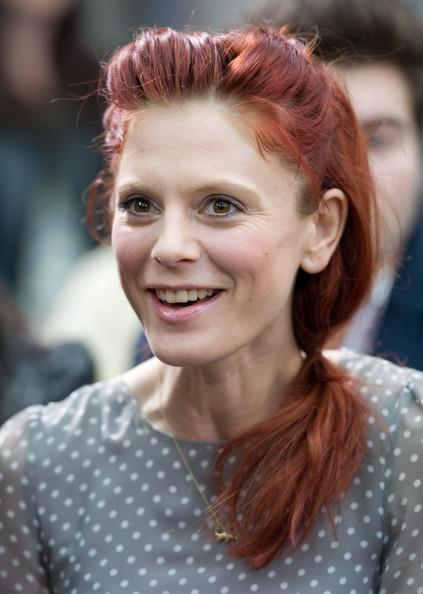</img>

*Image 1.1 - Imaging containing mostly the head*

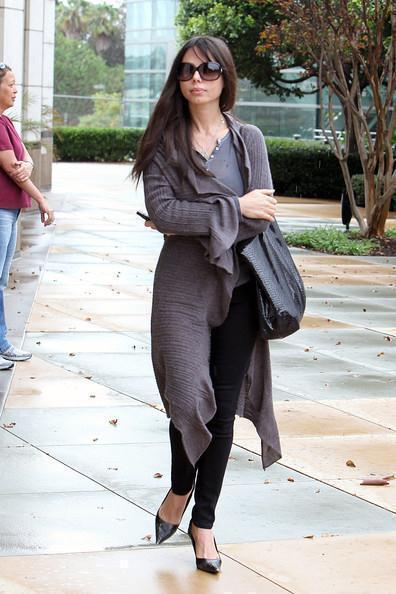</img>

*Image 1.2 - Imaging containing entire body*

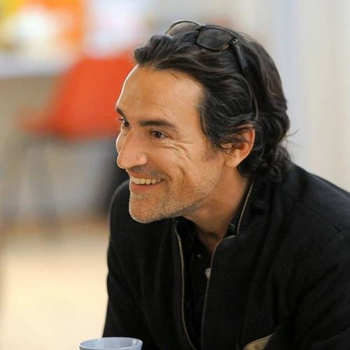</img>

*Image 2.1 - First Image of Individual 1058*

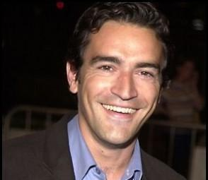</img>

*Image 2.2 - Second Image of Individual 1058*

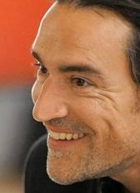</img>

*Image 3.1 - Image 2.1 segmented with bounding box annotation*

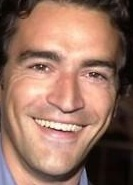</img>

*Image 3.2 - Image 2.2 segmented with bounding box annotation*

We added part of the data used to this GitHub repository, and the rest to a [Google Drive folder](https://drive.google.com/open?id=1hyYXqt3cPbxsjqjWoT4iSwf806Kri0ic).

## **Planned Steps**
To achieve our goals, we plan to take the following steps:

### **1. Dataset Filtering and Preprocessing**
We will reorganize and reformat the original dataset to better suit our needs and improve usability. Importantly, for the face verification algorithm, we will only use individuals with more than 5 images of them in the dataset.

### **2. Image Preprocessing**
We plan to apply image processing techniques to facilitate the segmentation process.

We will, firstly, resize the image to a more manageable and constant size for our algorithms. We are going to use the Bicubic Interpolation to preserve the details.

Also, we will test changes to the color domain of our images, to see whether that has a positive effect on the results. We will test the Grayscale, RGB, and possibly the HSL domains.

Lastly, we intend to use manual edge detection algorithms, such as the Canny Edge Detector, to see if they improve our results.

### **3. Face Segmentation**
After preprocessing, we will input the resulting image to a bounding box detection algorithm to segment the face from the rest of the image. We will compare traditional methods to a *CNN* based method that we will implement, both in terms of speed and accuracy. We will test Depthwise Separable Convolutions to reduce computational costs.

### **4. Face Feature Vector Generation**
With the cropped face, we will create a CNN model that generates a feature vector for the face. Such vectors should be similar for different images of the same person. To achieve this, we will use a pre-trained VGG16 network, trained on a different but similar problem and dataset, and fine-tune the vectors generated by a hidden layer of it using the Triplet Loss.

### **5. Face Verification**
With the feature vector extracted, a threshold applied to either the euclidian or cosine distance of 2 vectors should be enough to verify the individual.

## **Initial Code and Results**
As of the writing of this report, we have mostly focused on a codebase for later usage, and processing and organizing the dataset. The code is located on [src](./src/), and the processed data on [data](./data/) and on [Google Drive](https://drive.google.com/open?id=1hyYXqt3cPbxsjqjWoT4iSwf806Kri0ic).

However, we do have some initial results. We ran a basic CNN model, with no hyperparameter optimization, no data augmentation, and no image preprocessing. We obtained the following results during training. The orange line is the training metric, and the blue one the validation metric.

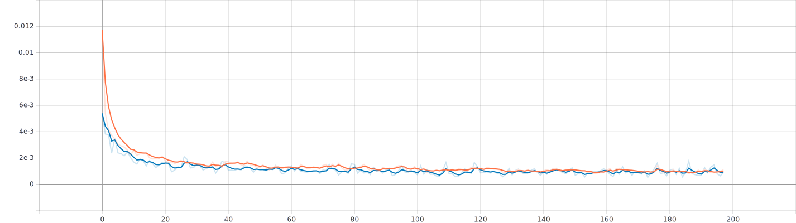</img>

*Image 4.1 - Mean Squared Error of bounding box location throughout training*

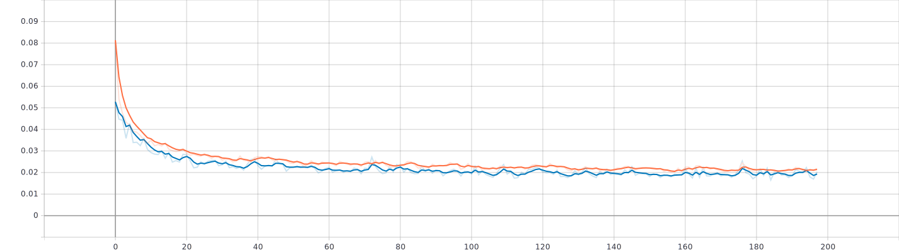</img>

*Image 4.2 - Mean Absolute Error of bounding box location throughout training*

The resulting model was used to crop 100 images for visualization. Those are stored in [sample_imgs/segmented/pred](./sample_imgs/segmented/pred/). We did the same process for comparison using the annotation data, and stored in [sample_imgs/segmented/true](./sample_imgs/segmented/true/). The resulting crops don't seem as precise as is expected from the metrics, so we will analize what may be occuring.

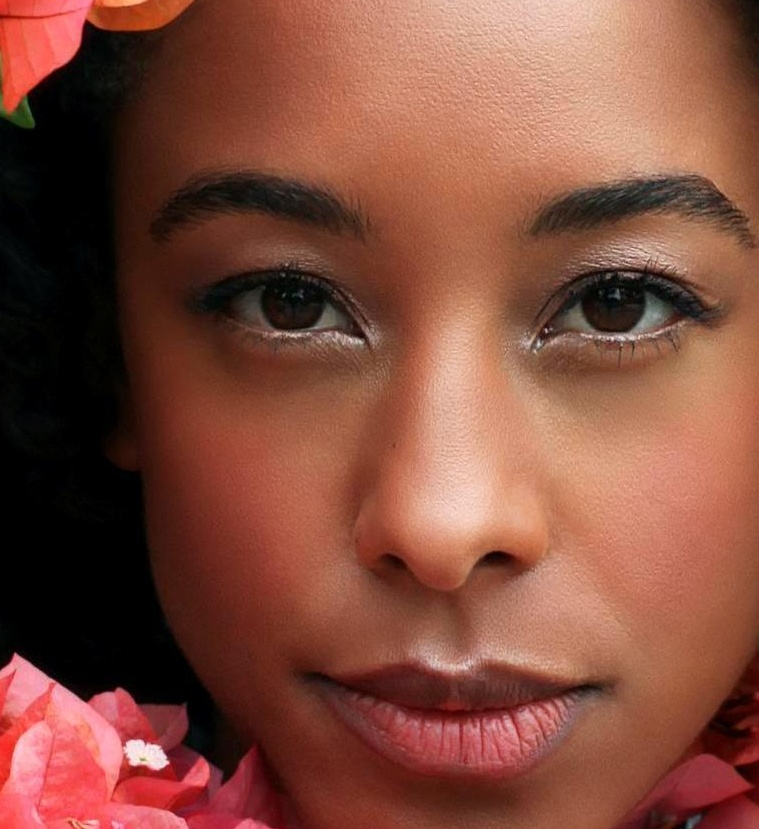</img>

*Image 5.1 - An instance where the model had a very good result*

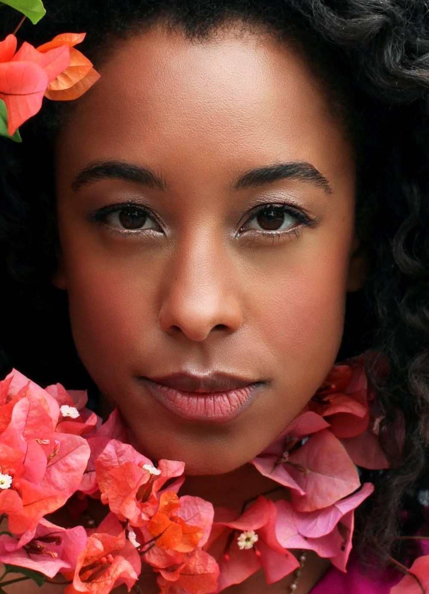</img>

*Image 5.2 - Ground Truth for Image 5.1*

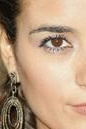</img>

*Image 6.1 - An instance where the model had bad but not terrible results. Most cases are like this*

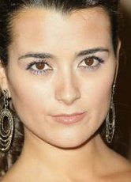</img>

*Image 6.2 - Ground Truth for Image 6.1*

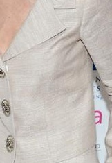</img>

*Image 7.1 - An instance where the model had terrible results*

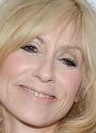</img>

*Image 7.2 - Ground Truth for Image 6.1*

We also developed a notebook with the baseline face detection algorithm, located at [sample_code/FaceDetectionCV](./sample_code/FaceDetectionCV.ipynb).

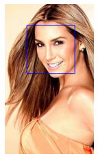</img>

*Image 8 - Baseline Face Detection Sample*

Finally, we implemented the canny edges detector, with a sample notebook at [sample_code/CannyEdgeExample](./sample_code/CannyEdgeExample.ipynb)

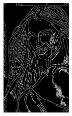</img>

*Image 9 - Canny Edge Detection Sample*

# **Final Report**

## **Data Used**

We decided to use the [CelebA](http://mmlab.ie.cuhk.edu.hk/projects/CelebA.html) dataset exclusevely. It has the annotations needed, and is also extremely large, having 202,599 images. There are two versions of it, one with the raw image, the other with the face already mostly cropped. We used the raw version. All the images are photographs of celebrities, in a variety of conditions, with their faces visible.

## **Steps With Results**

### **1. Dataset Filtering and Preprocessing**
We reorganized and reformated the original dataset to better suit our needs and improve usability. Importantly, for the face verification algorithm, we only used individuals with more than 5 images of them in the dataset. Also, for the bounding box annotation, we changed the way the data is represented. Originally, the data is given as the coordinates of the upper-left point of the bounding box, and the width and height of the bounding box. We changed it to the coordinates of the upper-left point and the bootom-right point of the bounding box. This resulted in better metrics.

### **2. Image Preprocessing**

#### **Data augmentation**

Our model wasn't generating good results when the face was on the bottom part of the image. That is because in most images of the dataset, the face is on the upper part. To solve that, we used a data augmentation technique, by translating the image randomly, without taking the face bounding box out of the image. After the translation, the image would contain an empty part (section that wasn't on the original image). To fix that we filled those parts with the closest edge color of the original image.

</img>

*Image 1.1 - Original Image*

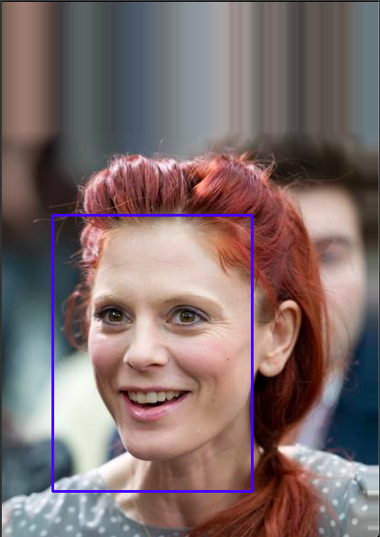</img>

*Image 1.2 - Image 1.1 Augmented with Translation, Keeping the Correct Bounding Box*

More examples can be found [here]("sample_code/DataAugmentationTranslation.ipynb").

#### **Resizing**
Our CNN models only take inputs of a specific size. So we need to resize the image to the correct size. This resizing needs to be done for every bacth of training, and when executing, so we decided to use the bilinear interpolation for its relative low computational cost.

#### **Failed Preprocessing**
We tested changes in the color domain and the canny edge detector to try to improve our results. They either made the results worse, or didn't improve significantly, so they were not used. Here are their results:

|Set|Loss                 |Mean Absolute Error|Mean Bbox Iou     |
|---|---------------------|-------------------|------------------|
|Train|0.0005421281675808132|0.015870939940214157|0.8575448989868164|
|Val|0.0006855816463939847|0.01681641675531864|0.8516016006469727|

*Table 1 - Base Metrics*

|Set|Loss                 |Mean Absolute Error|Mean Bbox Iou     |
|---|---------------------|-------------------|------------------|
|Train|0.00053440808551386  |0.015981484204530716|0.8573797941207886|
|Val|0.0006816008244641125|0.016900835558772087|0.8512943983078003|

*Table 2 - Changing color from RGB to HSV*

|Set|Loss                 |Mean Absolute Error|Mean Bbox Iou     |
|---|---------------------|-------------------|------------------|
|Train|0.0005476800724864006|0.016084963455796242|0.8568638563156128|
|Val|0.0007178573287092149|0.017143426463007927|0.8505929708480835|

*Table 3 - Changing color from RGB to Grayscale*

|Set|Loss                 |Mean Absolute Error|Mean Bbox Iou     |
|---|---------------------|-------------------|------------------|
|Train|0.018834181129932404 |0.10289715230464935|0.4456730782985687|
|Val|0.018753744661808014 |0.10262654721736908|0.44477757811546326|

*Table 4 - Using the Canny Edge Detector*

### **3. Face Segmentation**
We used CNN's to predict the bounding box of the face. Our CNN's receive an unsegmented image as input, and return 4 real number between 0 and 1. Those numbers are the relevant positions, repectevely, of the left, upper, right, and lower edges of the bounding box.

#### **Depthwise Separable Convolutions**
We used 2 different versions of our CNN's. One used standard convolutions, and the other used depthwise separable convolutions. Depthwise separable convolutions are a different operation, similar to regular convolutions, but with the aim to reduce number of parameters and, especially, number of operations. They do so by breaking up the channels of the input image, them performing a single convolution on each channel. Them, they recombine the resulting filtered images, and apply *N* regular convolutions, of size 1x1. This is best represented by image 2.

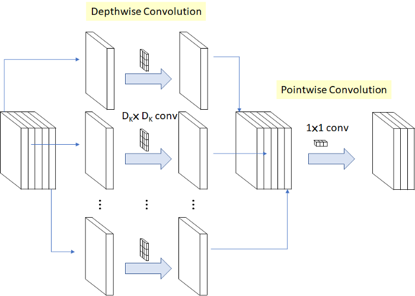</img>

*Image 2 - Depthwise Separable Convolution Representation. [Original Source of the Image](https://towardsdatascience.com/review-mobilenetv1-depthwise-separable-convolution-light-weight-model-a382df364b69)*

#### *Intersection Over Union*
To evaluate our models, we decided top use the intersection-over-union metric. It works by dividing the area of the intersection of the two bounding boxes by the area of their union.

</img>

*Image 3 - IoU Representation. [Original Source of the Image](https://www.pyimagesearch.com/wp-content/uploads/2016/09/iou_equation.png)*

For each type of convolution, we tried several different hyperparameters configurations, resulting in 54 experiments each. Here are the training graphs for the best models of each one.

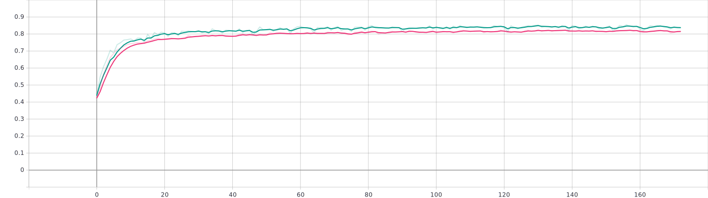</img>

*Image 4 - Regular CNN IoU over training. Green line is validation data, and pink is training*

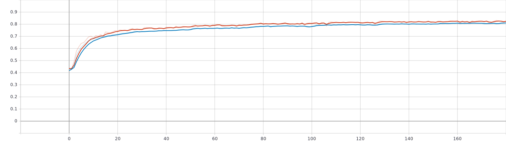</img>

*Image 5 - Depthwise Separable CNN IoU over training. Red line is validation data, and blue is training*

We then chose the best ones to improve with the data augmentation and image preprocessing described above.

#### *Comparison with OpenCV solution*

To evaluate our models results, we compared them to OpenCV's Face Detector. We used three different metrics: the Running Time, Intersection Over Union and Mean Absolute Error. The Mean Absolute Error is the sum of the absolute differences of all points of the predicted bounding boxes and the original bounding boxes, divided by the amount of points (4 time the amount of images).

The running time was obtained by running the algorithms on 500 random images from [data/Img](./data/Img/), belonging to the validation set. The metrics for OpenCV's algorithm were also obtained with these images. For our models, we used the metrics obtained during training. We limited our models to run on a single CPU core, for a more fair comparison.

|                                 | Regular Model | Model using Depth-Wise Separable Convolution | Model with Augmented Data | Model with Augmented Data using Depth-Wise Separable Convolution | OpenCV  |
|---------------------------------|---------------|----------------------------------------------|---------------------------|------------------------------------------------------------------|---------|
| Running time (seconds)          | 45.81         | 29.28                                        | 57.07                     | 31.03                                                            | 55.82   |
| Mean of Intersection over Union | 0.85160       | 0.83353                                      | 0.83756                   | 0.81453                                                          | 0.70790 |
| Mean Absolute Error             | 0.01681       | 0.01920                                      | 0.01832                   | 0.02145                                                          | 0.12914 |

*Table 5 - Bounding Box Detection Comparison*

### **4. Face Feature Vector Generation**
With the face segmented, we need to generate a feature vector capable of differenciating people. To achieve that, we used a pre-treined CNN to extract such feature vector. We got the pre-trained weights from [this link](https://drive.google.com/file/d/1CPSeum3HpopfomUEK1gybeuIVoeJT_Eo/view), originally provided on [this webpage](https://sefiks.com/2018/08/06/deep-face-recognition-with-keras/)

This CNN was originally trained on a classical classification problem, having to classify to whom, in a set of 2622 people, an image belonged. As such, we can't use it directly. To use it, we get the output of the last layer before the classification layer, and use it as an feature extractor.

#### *Triplet Loss*
To fine tune the feature extraction, we trained the extractor using the triplet loss. Here is its equation:

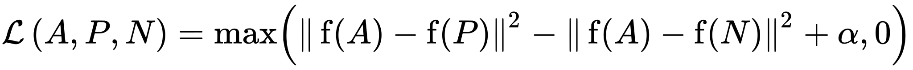</img>

*Image 6 - Mathematical Equation of the Triplet Loss. [Original Source of the Image](https://en.wikipedia.org/wiki/Triplet_loss#:~:text=Triplet%20loss%20is%20a%20loss,a%20negative%20(falsy)%20input.)*

Where f is the feature extraction function, A is the anchor, P is the positive example (same person as A), and N is the negative example (different person than A), and *alpha* is a constant value. As such, as this loss decreases, the distances between images of the same person decrease, and the distances between images of the different people increase.

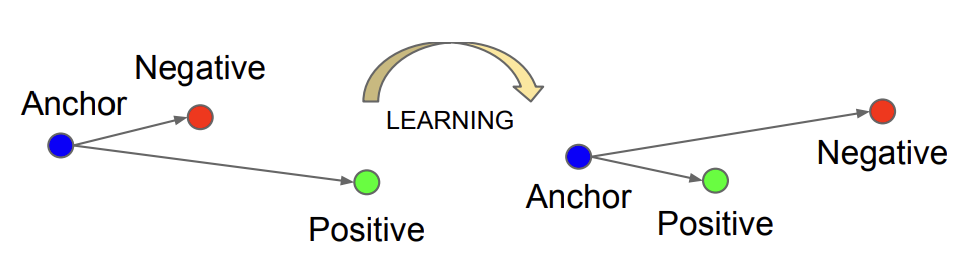</img>

*Image 7 - Graphical Representation of the Triplet Loss. [Original Source of the Image](https://arxiv.org/pdf/1503.03832.pdf)*

The distance function in this scenario is the euclidian distance. We used as distance functions for our models the euclidian distance squared, and the cossine distance. Here are the training graphs:

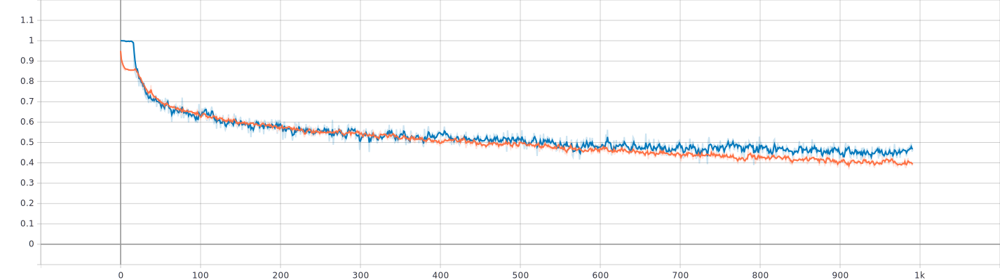</img>

*Image 8 - Euclidian Distance Triplet over training. Blue line is validation data, and orange is training*

|Set  |Pos Dist Mean     |Neg Dist Mean     |Triplet Loss Mean |
|-----|------------------|------------------|------------------|
|Train|0.5728581547737122|1.745187759399414 |0.22523514926433563|
|Val  |0.6698782444000244|1.7403087615966797|0.2757253348827362|

*Table 6 - Distances Using The Euclidian Distance*

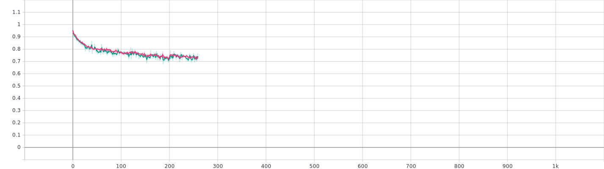</img>

*Image 9 - Cossine Distance Triplet over training. Green line is validation data, and pink is training*

|Set  |Pos Dist Mean     |Neg Dist Mean     |Triplet Loss Mean|
|-----|------------------|------------------|-----------------|
|Train|0.445333868265152 |0.8501749038696289|0.595158576965332|
|Val  |0.4381791949272156|0.8464183807373047|0.59176105260849 |

*Table 7 - Distances Using The Cossine Distance*

### **5. Face Verification**
After training the feature extractor with the triplet loss, we simply set the average of the mean positive distances and the mean negative distances as a threshold. If two vectors have a distance smaller than the threshold, they are considered as belonging to the same person, and to different people otherwise.
We used this as a classifier and extracted some metrics.

|Set  |Binary Accuracy   |Precision         |Recall            |True Negatives|False Positives|False Negatives|True Positives|
|-----|------------------|------------------|------------------|--------------|---------------|---------------|--------------|
|Train|0.8604687452316284|0.871737003326416 |0.8453124761581421|14010.0       |1990.0         |2475.0         |13525.0       |
|Val  |0.8305624723434448|0.8596084117889404|0.7892890572547913|13977.0       |2058.0         |3364.0         |12601.0       |

*Table 8 - Classifier Using The Euclidian Distance*

|Set  |Binary Accuracy   |Precision         |Recall            |True Negatives|False Positives|False Negatives|True Positives|
|-----|------------------|------------------|------------------|--------------|---------------|---------------|--------------|
|Train|0.7213125228881836|0.7808796763420105|0.6143545508384705|13264.0       |2755.0         |6163.0         |9818.0        |
|Val  |0.722406268119812 |0.77568119764328  |0.6221036314964294|13210.0       |2865.0         |6018.0         |9907.0        |

*Table 9 - Classifier Using The Cossine Distance*

## **Conclusions and Considerations**
With regards to the segmentation aspect of the project, our final models showed good performance. They were both faster and more precise then OpenCV's. However, our models only detect a single face in an image, not multiple. This is sutible for many situations, for example unlocking a phone, but not all situatiuons, for example monitoring a street.

For the segmentation, we had 4 final models, in a combination of being trained using the translation augmentation, and using the depthwise separable convolutions. The augmented models had a worse performance in the dataset, but probably have a better performance in a real world scenario, but we can't test it at this moment. The models using depthwise separable convolutions have a slightly worse performance, but much lower computational cost, therefore they are more suited for situations where low computational cost and response time are more relevant, such as real-time segmentation, and embedded systems.

With regards to the verification aspect of the project, our final models showed good performance, but could be better, with the euclidian distance model showing better performance. We focused more on the former aspect of the project, so our verification is not as refined. One major improvement would be define the distance threshold in a more sophisticated way. They way we are currently doing doesn't take in consideration the distance distribution as a whole, just the mean. Still the verification works quite well. One notable failure is with oclusion, as shown in the images below.

## **Sample Code and Results**

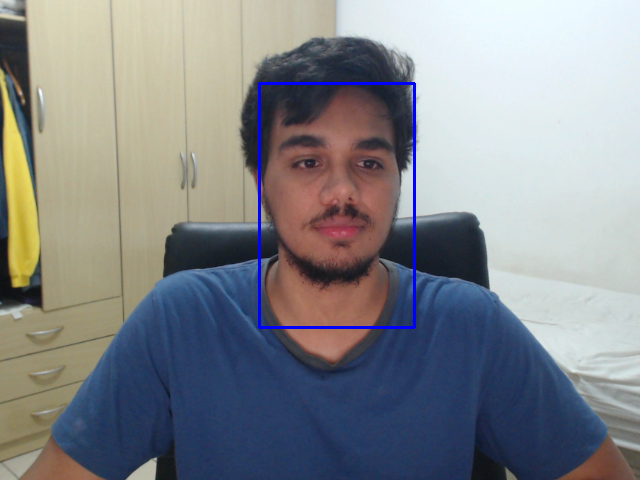</img>

*Image 10 - Bounding Box Detection Example*

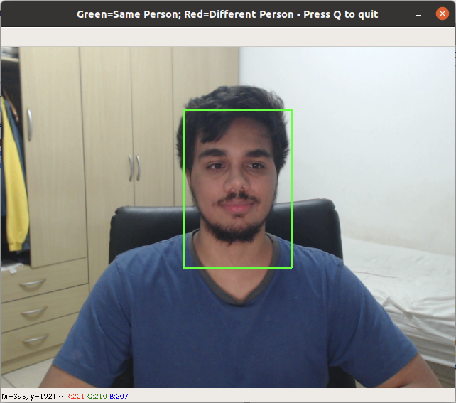</img>

*Image 11.1 - Succesful Verification*

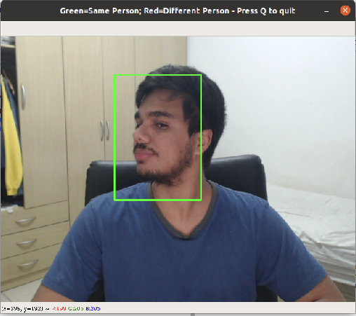</img>

*Image 11.2 - Succesful Verification at an Angle*

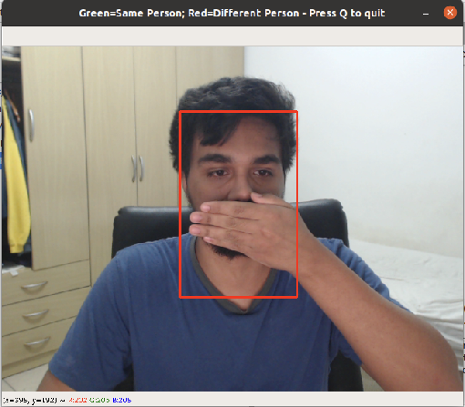</img>

*Image 12.1 - Unsuccesful Verification with little occlusion*

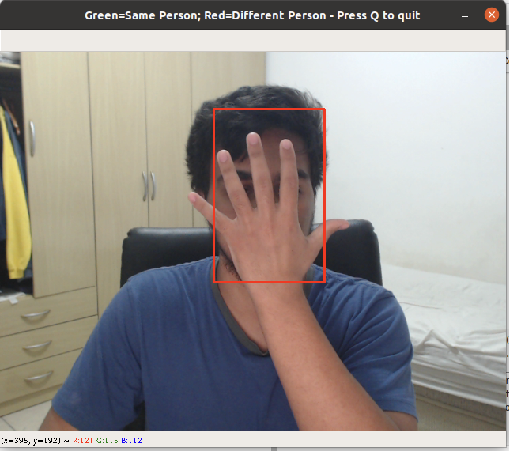</img>

*Image 12.2 - Unsuccesful Verification with high occlusion*

This images were extracted using [this jupyter notebook](./sample_code/FinalReportDemonstration.ipynb). It is a sample where our models are run using a webcam as input. For it to work, the environment defined in [env.yml](./env.yml) should be installed, using conda.

All trained models are available at our [Google Drive](https://drive.google.com/drive/folders/1R3cb0nj81Y21L5N6LgH9R_AdeinWRQHC?usp=sharing) (the files were too big to add to this repository). All the metrics csv's are available at [experiments/results](./experiments/results).

## **Members Tasks**
- Eduardo Santos Carlos de Souza (NUSP 9293481)
    * Wrote model building code
    * Wrote model training code
    * Wrote data generators for training
    * Preprocessed and organized data
    * Ran many experiments

- Guilherme Hideo Tubone (NUSP 9019403)
    * Wrote face detection using OpenCV, and its code sample
    * Implemented Canny Edge Detector and its code sample
    * Created benchmarks to measure running time
    * Measured intersection-over-union and mean absolute error for the OpenCV model
    * Implemented data augmentation of translation and rotation
    * Ran some training experiments

---

**Keywords:** Image Segmentation; Feature Learning; Deep Learning; Faces; Face Verification; Triplet Loss;
